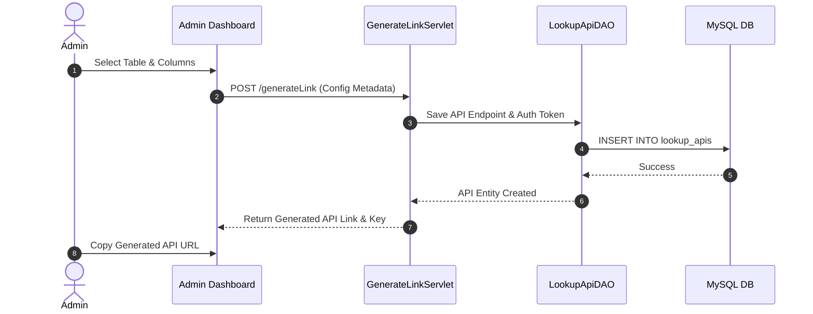

# ⚙️ Dynamic Data Collection, Communication & Management Framework (DCCMF)

[](https://www.oracle.com/java/)
[](https://tomcat.apache.org/)
[](https://www.mysql.com/)
[](LICENSE)

## ℹ️ About Project

The **Dynamic Data Collection, Communication & Management Framework (DCCMF)** is a flexible, database-driven framework designed to automate RESTful lookup API generation, bulk data collection, multi-channel record communication, and runtime table schema configurations without requiring code changes or redeployments.

---

## 🌟 Key Features

- 🛠️ **Dynamic Schema Configuration**: Runtime configuration of database tables, column labels, visibility, and search filters.
- 🔌 **Automated Lookup API Generator**: Instantly generate RESTful lookup API endpoints (`LookupApiServlet`) with dynamic parameters for external service integrations.
- ⚡ **Bulk Updates & Data Collection**: Batch data updates (`BulkUpdateServlet`) and CSV file uploads (`FileUploadServlet`) with built-in validation.
- 📡 **Data Communication Layer**: Shareable API link generation and dynamic form rendering (`userForm.jsp`, `generateApi.jsp`) for client-side data submission and communication.
- 🛡️ **Security & SQL Injection Guard**: Parameterized query building (`SqlInjectionGuard`) and AES payload encryption (`EncryptionUtil`).
- 📊 **Admin Dashboard & Link Manager**: Centralized interface (`manageLinks.jsp`, `generateApi.jsp`) to configure API tokens, auth filters (`AuthFilter`), and table metadata.

---

## 🔄 Sequence Workflow



---

## 📁 Repository Structure

```text
dccmf/
├── src/
│   └── main/
│       ├── java/
│       │   ├── apps/
│       │   │   └── dccmf/
│       │   │       ├── servlet/             # API & Configuration Servlets
│       │   │       └── util/                # DAO, Encryption, Guard & Json Services
│       │   └── apps/
│       │       └── dbservice/               # Shared HikariCP Connection Pool
│       ├── resources/
│       │   └── db.properties                 # Database Configuration
│       └── webapp/
│           └── apps/
│               └── dccmf/                   # Admin Panels, API Generator & User Forms
└── README.md
```

---

## 🛠️ Components Matrix

| Servlet / Utility | Description |
| :--- | :--- |
| `LookupApiServlet.java` | Dynamic REST API endpoint handler for external lookups. |
| `GenerateLinkServlet.java` | Controller for creating shareable, authenticated API links. |
| `BulkUpdateServlet.java` | Batch update engine for updating table records in bulk. |
| `FetchTablesServlet.java` | Database inspection service retrieving available tables. |
| `FetchColumnsServlet.java` | Column metadata provider for selected database tables. |
| `SqlInjectionGuard.java` | Security utility sanitizing dynamic SQL parameters. |
| `EncryptionUtil.java` | AES encryption and token hashing utility. |

---

## 🚀 Quick Start

1. Import `db.properties` and set database details.
2. Deploy to Apache Tomcat 9.0+.
3. Access Admin Dashboard:
   ```text
   http://localhost:8080/apps/apps/dccmf/admin/login.jsp
   ```

---

## 📄 License
Licensed under the **MIT License**.
